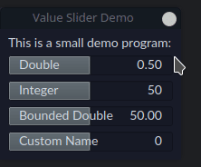

# Qt Value Slider

This repository contains two new widgets that allow the user to better control decimal and integer values.
The widget layout is inspired by Blender.



## Dependencies

- Qt >6
- CMake 3.5

## Features

- Drag left/right to decrease/increase the value.
- Click to manually enter a value.
- Displays both the name of the slider and the value.
- Name is customizable.
- Slider can be initialized with bounds. Enforcing of these bounds is optional.
- Integer and double slider support: `IntSlider` and `DoubleSlider`.

## Usage

The value sliders can easily be integrated into your project.
Start by cloning the repository:

```bash
git clone git@github.com:BugelNiels/qt-value-slider.git
```

Provided that you cloned this within your project, you should be able to easily add this to any existing CMake projects:

```cmake
add_subdirectory(qt-value-slider)

target_link_libraries(${PROJECT_NAME} PUBLIC valueSliders)
```

Alternatively, you can copy-paste the files directly into your project.

Note that due to the fact that the sliders are based on `QProgressBar`, setting/getting the values should be done using
`getVal()` and `setVal()` respectively (and not `setValue()`!).

## Compilation

To compile the library, execute the following:

```bash
mkdir build
cd build
cmake ..
make
```

To run the demo, you can  temporarily change `set(SLIDER_LIBRARY ON)` in the `CMakeLists.txt` to `OFF`.
This will allow you to generate a `valueSliders` binary.